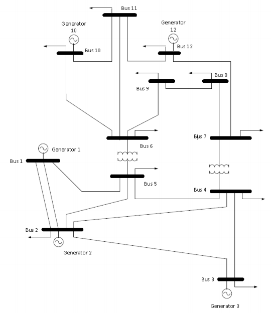

# EE 454 Final Project

## Power Flow Solver

### Overview

This program analyzes a power system and solves for bus voltages using the Newton-Raphson method.

### Arguments

The program accepts the following arguments:

* input_workbook: The name of the Excel workbook containing bus and line data (default: "data/Data.xlsx").
* bus_data_worksheet: The name of the worksheet containing bus data (default: "Bus data").
* line_data_worksheet: The name of the worksheet containing line data (default: "Line data").
* start_voltage_magnitude: The initial voltage in per-unit to set for each unknown bus voltage (default: 1 pu).
* start_voltage_angle: The initial voltage phase angle in degrees to set for each unknown bus voltage (default: 0 degrees).
* slack_bus_number: The slack bus number (default: 1).
* power_base: The power base in MVA (default: 100).
* max_active_power_error: The maximum allowed real power mismatch in MW (default: 0.1).
* max_reactive_power_error: The maximum allowed reactive power mismatch in Mvar (default: 0.1).
* min_operating_voltage: The minimum acceptable per-unit voltage magnitude at a bus.
* max_operating_voltage: The maximum acceptable per-unit voltage magnitude at a bus.

### Input Format

The input is expected to be an Excel workbook with two worksheets: one for bus data and another for line data.

#### Bus data

The worksheet containing bus data is expected to have the following columns:

1. Bus number
2. Real power consumed (MW)
3. Reactive power consumed (Mvar)
4. Real power delivered (MW)
5. Voltage (pu)

#### Line data

The worksheet containing line data is expected to have the following columns:

1. Source bus
2. Destination bus
3. Total resistance (pu)
4. Total reactance (pu)
5. Total susceptance (pu)
6. Maximum rated power (MVA)

### Reference Power System

Some sample inputs are provided in the "data" subdirectory. The reference case for this program is a 12-bus system specified in "data/Data.xlsx." A diagram for this system is shown below.

#### Bus data

| Bus | P load (MW) | Q load (Mvar) | P gen (MW) | V (pu) |
| --- |------------ | ------------- | ---------- | ------ |
| 1 |  |  |  | 1.05 |
| 2 | 21.7 | 12.7 | 40 | 1.045 |
| 3 | 94.2 | 19 | 26 | 1.01 |
| 4 | 47.8 | -3.9 |  | |
| 5 | 7.6 | 1.6 |  | |
| 6 | 11.2 | 7.5 |  | |
| 7 | 29.5 | 16.6 |  | |
| 8 | 9 | 5.8 |  | |
| 9 | 3.5 | 1.8 |  | |
| 10 | 6.1 | 1.6 | 28 | 1.05 |
| 11 | 13.5 | 5.8 |  | |
| 12 | 14.9 | 5 | 30 | 1.05 |

#### Line data

| Src | Dst | R (pu) | X (pu) | B (pu) | Fmax (MVA) |
| --- |---- | ------ | ------ | ------ | ---------- |
| 1 | 2 | 0.03876 | 0.11834 | 0.0264 | 47.5 |
| 1 | 2 | 0.03876 | 0.11834 | 0.0264 | 47.5 |
| 1 | 5 | 0.05403 | 0.22304 | 0.0492 | 100 |
| 2 | 3 | 0.04699 | 0.19797 | 0.0438 | |
| 2 | 4 | 0.05811 | 0.17632 | 0.034 | |
| 2 | 5 | 0.05695 | 0.17388 | 0.0346 | |
| 3 | 4 | 0.6701 | 0.17103 | 0.0128 | |
| 4 | 5 | 0.01335 | 0.04211 | 0 | |
| 4 | 7 | 0 | 0.55618 | 0 | |
| 5 | 6 | 0 | 0.25202 | 0 | |
| 6 | 9 | 0.09498 | 0.1989 | 0 | |
| 6 | 10 | 0.12291 | 0.25581 | 0 | |
| 6 | 11 | 0.06615 | 0.13027 | 0 | |
| 7 | 8 | 0.03181 | 0.0845 | 0 | |
| 7 | 12 | 0.12711 | 0.27038 | 0 | |
| 8 | 9 | 0.08205 | 0.19207 | 0 | |
| 10 | 11 | 0.22092 | 0.19988 | 0 | |
| 11 | 12 | 0.17093 | 0.34802 | 0 | |
